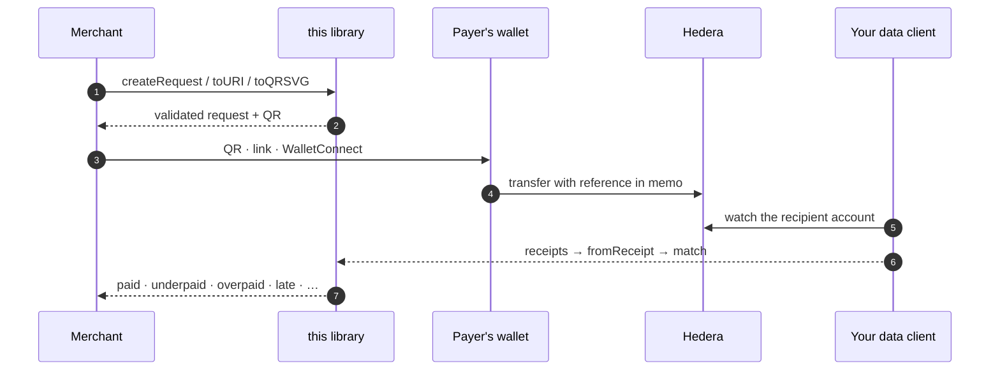

# hiero-payment-requests (TypeScript)

[](https://github.com/hiero-hackers/hiero-payment-requests/actions/workflows/ci.yml)
[](https://github.com/hiero-hackers/hiero-payment-requests/actions/workflows/codeql.yml)
[](LICENSE)
[](package.json)
[](https://scorecard.dev/viewer/?uri=github.com/hiero-hackers/hiero-payment-requests)

**Ask for a Hedera payment, and prove it was made.**

A payment request built on the CAIP identifiers Hedera already standardised, and
the **matching rule** that decides whether a transaction fulfils it. Pure — no
network, no runtime dependencies, and **browser-ready** (a test forbids Node
builtins in `src/`, so that guarantee cannot rot). You bring the transactions.
Prototype.

```
create request  →  share it        →  observe the chain  →  match
CAIP-10/CAIP-19    QR / link /        your data client      paid | underpaid |
                   WalletConnect                            overpaid | late | …
```

The whole loop, end to end — this library is the first and last arrow; the
chain and your data client stay yours:



"Share it" is a real wire format, not an exercise for the reader:

```ts
import { toURI, fromURI } from "@hiero-hackers/hiero-payment-requests";

toURI(request);
// hiero-pay:hedera:mainnet:0.0.1234-pikcw?v=1&asset=…&amount=100000000&ref=INV-2026-041
// → QR code, link, or WalletConnect payload. Integer base units, never
//   decimals (BIP-21's mistake); strict versioned parsing (unknown params
//   are errors, not surprises); decoding VALIDATES — a bad checksum fails
//   at the scanner, not three weeks later.

fromURI(uri); // → a validated PaymentRequest

// Until wallets register hiero-pay:, a bare-scheme QR makes phones shrug
// ("no usable data found"). Wrap it in a link your checkout page unwraps —
// the request rides in the #fragment, which browsers never send to servers:
toLink(request, "https://pay.example.com/");
// https://pay.example.com/#hiero-pay:hedera:mainnet:0.0.1234?v=1&…
fromLink(link); // → a validated PaymentRequest (checkout's side)

// And when a wallet adapter needs the actual transfer fields, the CAIP
// parsing stays in here — memo included, because the memo is what makes
// the payment correlatable:
paymentInstructions(request);
// { network: "mainnet", recipient: "0.0.1234",
//   asset: { kind: "token", id: "0.0.720" }, amount: 100000000n,
//   memo: "INV-2026-041" }
```

And the QR itself is built in — no dependency, spec-implemented in-house and
verified in the tests by an _independent_ decoder (every matrix must decode
back to the exact URI, at every version and error-correction level):

```ts
import { toQRSVG, toQRTerminal } from "@hiero-hackers/hiero-payment-requests";

toQRSVG(request); // standalone SVG — email it, print it, inline it
toQRSVG(request, { ecc: "Q" }); // more redundancy for rough scanning conditions
console.log(toQRTerminal(request, { invert: true })); // scannable in a dark terminal
```


The code on the right is not a screenshot — it is committed `toQRSVG()` output
for the example request above, and a drift test regenerates it byte-for-byte,
so the image in this README can never quietly stop being what the library
produces. Scan it: your phone reads the `hiero-pay:` URI. (For one in your
terminal: `node examples/qr.ts`.)

The code carries exactly the `hiero-pay:` URI, and the request is validated
before a single module is drawn — a bad checksum never becomes someone's
wall poster.

APIs speak the JSON form (`encodeRequest` / `decodeRequest`), specified by
[schema/payment-request.v1.schema.json](schema/payment-request.v1.schema.json).
Scanned or pasted _something_? `fromAny(text)` dispatches to whichever form it
is — URI, link, or JSON — each parsed at full strictness. And a verdict is
storable too: `encodeFulfilment` / `decodeFulfilment` round-trip a
`Fulfilment` as JSON with exact-string amounts (plain `JSON.stringify` throws
on `bigint` — webhooks and audit logs need this codec).

> **Implementing `hiero-pay:` in another language?** The package ships
> [official test vectors](vectors/wire.v1.json) — canonical encodings to
> match byte-for-byte, and invalid inputs your parser must reject. They are
> drift-tested against this implementation on every commit.

Every merchant, exchange, and payment integration on Hedera hand-rolls this:
_generate a unique reference → watch for a transaction carrying it → mark paid._
Everyone gets the same edge cases wrong, and no two systems can read each other's
requests. This is that, once, carefully.

## Quick start

Published on the GitHub Packages npm registry (`@hiero-hackers` scope —
needs a one-time `read:packages` token, a GitHub rule even for public
packages; the scope→registry mapping and token setup are one command each):

```sh
npm config set @hiero-hackers:registry https://npm.pkg.github.com
npm config set //npm.pkg.github.com/:_authToken "$(gh auth token)"
npm install @hiero-hackers/hiero-payment-requests
```

Working on this repo itself needs none of that — zero runtime deps:

```sh
npm install && npm run build
```

```ts
import { createRequest, match } from "@hiero-hackers/hiero-payment-requests";

const request = {
  recipient: "hedera:mainnet:0.0.1234", // CAIP-10 — carries the network
  asset: "hedera:mainnet/token:0.0.720", // CAIP-19
  amount: 100_000000n, // smallest unit, always an integer
  reference: "INV-2026-041",
  expiresAt: "1783012345.000000000", // consensus timestamp, not wall clock
};

createRequest(request); // validates now, not three weeks from now
match(request, payments); // → { status: "paid", received: 100000000n, late: false }
```

## The answer is not a boolean

That's the whole reason this is a library. A customer can underpay, overpay, pay
twice, pay late, pay the wrong asset, pay on the wrong network, or pay a token
that skims a custom fee on the way. Each is a **different fact**, and you need to
know which one happened:

```ts
type Fulfilment =
  | { status: "unpaid" }
  | { status: "expired" }
  | { status: "wrong-asset"; payments }
  | { status: "underpaid"; received; shortfall; payments; late }
  | { status: "paid"; received; payments; late }
  | { status: "overpaid"; received; excess; payments; late };
```

**It computes the facts; your policy decides what they mean.** The library never
decides whether an overpayment counts as settled, or whether ninety seconds late
is acceptable — those are yours.

And when the verdict calls for a follow-up, that's derivable too:
`remainderRequest(request, fulfilment)` re-presents an underpaid request for
exactly what's left — **same reference, deliberately**, so the next payment
accumulates into the original match instead of orphaning the first one — and
`refundInstructions(request, fulfilment)` states what an overpayment or
wrong-asset payment owes back (who, how much, which asset, `REFUND <ref>`
memo), with the refund target honestly labeled a heuristic: it is the
transaction's fee payer, which for custodial senders may be an exchange's hot
wallet — confirm with the customer before sending. Facts, not actions: this
library never moves money.

See every answer it can give, for one invoice and ten things a customer might
actually do — offline, in milliseconds:

```sh
node examples/fulfilment-states.ts  # every verdict, ten customer behaviours
node examples/merchant-flow.ts      # one invoice end to end: create → share →
                                    # wallet fields → underpaid → remainder →
                                    # overpaid → refund instructions
```

```
  pays twice (100 + 100)
    → OVERPAID — received 200 across 2 payment(s), excess 100
      surfaced with BOTH transactions so you can refund one — not swallowed as 'already paid'

  sends 100, but the token skims a 2% custom fee
    → UNDERPAID — received 98, short 2
      THE TRAP: match the sender's intent and you'd call this paid, and be 2 short forever
```

## The traps it handles

- **Custom fees.** An HTS token can skim a fractional fee — a customer sends 100,
  you're credited 98. Matching reads the recipient's **credit**, never the
  sender's debit. Naive integrations mark that paid and come up short.
- **Double payment** → `overpaid` with _both_ transactions attached, so you can
  refund one. Never silently swallowed.
- **Partial payments** aggregate: three transfers with one reference → `paid`.
- **Late** is judged on the **consensus timestamp**. A payer's laptop clock isn't
  a fact.
- **Timestamps aren't strings.** `"10.9"` is _later_ than `"10.000000000"`; a
  lexical compare says otherwise. Nanos are padded and compared as integers.
- **Wrong network** can't settle a request — the network rides inside the CAIP
  identifier, so a testnet payment never fulfils a mainnet invoice.
- **`bigint` throughout.** Amounts are smallest-unit integers; entity ids are
  64-bit. CAIP-76's own test vector is `9223372036854775807` — a `number`-based
  parser corrupts the spec's own example.

## Built on the standard, not around it

We adopt [HIP-30](https://hips.hedera.com/HIP/hip-30.html) (which subsumes
HIP-20) and [CAIP-76](https://standards.chainagnostic.org/CAIPs/caip-76):

| CAIP-2 chain        | `hedera:mainnet`                              |
| ------------------- | --------------------------------------------- |
| **CAIP-10 account** | `hedera:mainnet:0.0.1234` (+ HIP-15 checksum) |
| **CAIP-19 token**   | `hedera:mainnet/token:0.0.720`                |
| **CAIP-19 NFT**     | `hedera:mainnet/nft:0.0.721/3`                |

`hedera:` was never ours to claim — it's already the CAIP-2 namespace. And
WalletConnect speaks CAIP natively (that's _why_ HIP-30 exists), so this asks no
wallet to adopt anything new.

**Hedera is the first network, not the definition.** CAIP identifiers are
chain-agnostic by design, and everything Hedera-specific — namespace, HIP-15
ledger id, native coin — is one table (`HIERO_NETWORKS`) in
[src/caip/network.ts](src/caip/network.ts). Another Hiero network joins by
adding a row (a compile-time guard makes you extend the one-line `Network`
union to match); parsing, checksum verification, and the native-asset form
all follow. The set stays **closed** on purpose — an unknown
chain is a loud error, never a guess — and it will not pretend to support
non-Hiero chains: `eip155:1` would parse fine, but the matching semantics
(memos, consensus timestamps, net credits) are Hiero's, and claiming otherwise
would be a quiet lie.

NFT requests match **exactly their serial** all the way through: a receipt's
incoming NFTs become credits of `nft:<token>/<serial>`, so serial #4 of the same
collection reports `wrong-asset`, not `paid` — a serial is an identity, not a
quantity. (For the same reason, an NFT request's amount can only be 1;
`createRequest` rejects anything else as unfulfillable.)

> **⚠ One provisional identifier.** HIP-30 defines `token:` and `nft:` but **no
> identifier for native HBAR** — so _"pay me 100 ℏ"_ can't name its asset in the
> standard. We use `hedera:mainnet/slip44:3030`, following CAIP-19's convention
> for native coins (`eip155:1/slip44:60`). **This is not in HIP-30**, is flagged
> provisional in the code, and the coin type needs confirming against SLIP-0044.
> Closing that gap upstream is the first contribution this repo should make.

## How it composes

`fulfils()` returns a predicate that is _structurally_ a `Condition<Receipt>` in
[`hiero-notifications`](https://github.com/hiero-hackers/hiero-notifications) —
so the loop closes with **no dependency in either direction**:

```ts
import { watch, accountWatcher } from "hiero-notifications";
import { fulfils, fromReceipt } from "@hiero-hackers/hiero-payment-requests";

await watch({
  watcher: accountWatcher({ accounts: ["0.0.1234"] }),
  condition: fulfils(request, (r) => fromReceipt(r, "mainnet")),
  deliveries: [markInvoicePaid],
});
```

`fulfils` is strict — one receipt, exactly paid. Real customers pay 60 + 40:
`fulfilsAccumulating(request, …)` folds every correlating receipt into a
running tally and fires **exactly once, on the receipt that completes
payment** — deduplicating on transaction id, so an at-least-once feed
(re-deliveries, `--replay`) can never fire it early or twice.

```
hiero-payment-requests  →  hiero-notifications  →  hiero-receipts
  issue the request         watch for fulfilment    issue the receipt
```

## What it deliberately doesn't do

Fetch anything · decide settlement · value anything in fiat (that's
`hiero-receipts`).

## Known open question

Correlation assumes **wallets let a payer set a memo**. That's an empirical claim
about the wallet ecosystem and it is **not yet verified**. The hedge ships in
the box: `byUniqueAmount` correlates on an exactly-unique amount instead —
`assignDistinctAmount` gives each open invoice its own amount (a few base
units of dust above the price), and then any wallet that can send a number
works, memo or no memo. The trade is stated in its doc: near-misses
(underpaid, overpaid, fee-skimmed) report `unpaid`, because with no other
correlator they cannot honestly be claimed for this request. Strategies are
injectable (`MatchOptions.correlate`) and the pipeline canonicalizes whatever
a strategy returns, so the match invariants hold for every strategy. The
endgame is **scheduled transactions**, where correlation stops being a
heuristic and becomes a fact. See
[docs/ARCHITECTURE.md](docs/ARCHITECTURE.md).

## Develop

```sh
npm run typecheck   # tsc --noEmit
npm test            # vitest — the CAIP tests run the specs' own literal vectors
npm run build       # → dist/
```

## License

Apache-2.0
